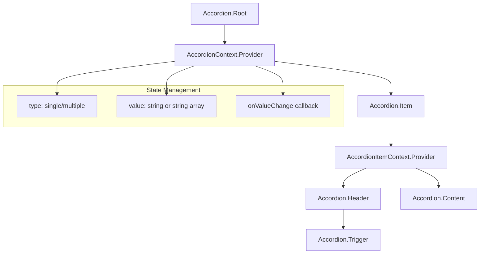
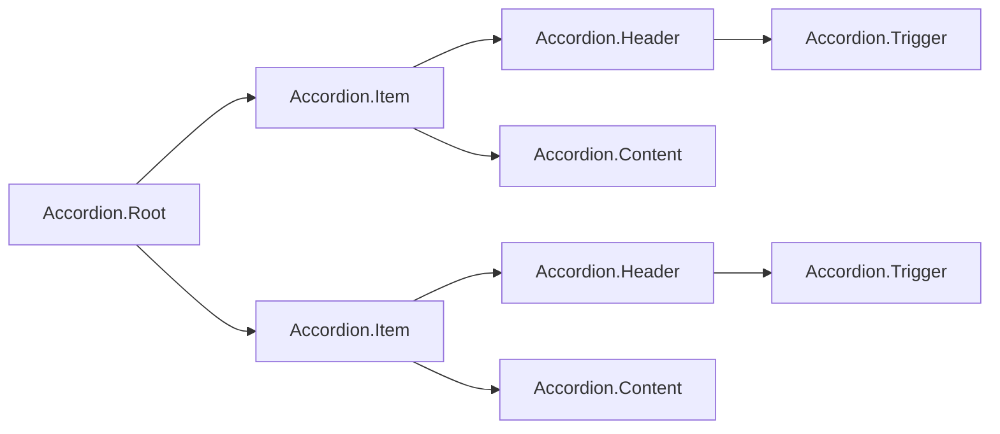

# Accordion Component Implementation Plan

## Overview

This document outlines the implementation plan for the Accordion component in `@radix-ui/themes-native`. The Accordion is a vertically stacked set of interactive headings that each reveal associated content sections.

## Component API Design

Following the Radix UI patterns and the existing component structure in this project, the Accordion will use a compound component pattern:

```tsx
import { Accordion } from '@radix-ui/themes-native';

// Single mode - only one item open at a time
<Accordion.Root type="single" defaultValue="item-1" collapsible>
  <Accordion.Item value="item-1">
    <Accordion.Header>
      <Accordion.Trigger>First Item</Accordion.Trigger>
    </Accordion.Header>
    <Accordion.Content>Content for first item</Accordion.Content>
  </Accordion.Item>
  <Accordion.Item value="item-2">
    <Accordion.Header>
      <Accordion.Trigger>Second Item</Accordion.Trigger>
    </Accordion.Header>
    <Accordion.Content>Content for second item</Accordion.Content>
  </Accordion.Item>
</Accordion.Root>

// Multiple mode - multiple items can be open
<Accordion.Root type="multiple" defaultValue={['item-1', 'item-2']}>
  ...
</Accordion.Root>
```

## Component Structure

### Directory Location

The Accordion component will be placed in a new `disclosure` directory under `packages/radix-ui-themes-native/src/components/`:

```
packages/radix-ui-themes-native/src/components/
  disclosure/
    Accordion.tsx
    index.ts
```

This follows the categorization pattern where disclosure components (Accordion, Collapsible) are grouped together.

### Sub-components

#### 1. AccordionRoot

The root component that manages the accordion state via React Context.

**Props:**
| Prop | Type | Default | Description |
|------|------|---------|-------------|
| `type` | `'single' \| 'multiple'` | required | Whether one or multiple items can be open |
| `value` | `string \| string[]` | - | Controlled value(s) of open items |
| `defaultValue` | `string \| string[]` | - | Default uncontrolled value(s) |
| `onValueChange` | `(value: string \| string[]) => void` | - | Callback when value changes |
| `collapsible` | `boolean` | `false` | When type is single, allows closing the open item |
| `disabled` | `boolean` | `false` | Disable all items |
| `dir` | `'ltr' \| 'rtl'` | `'ltr'` | Direction for chevron rotation |
| `size` | `'1' \| '2' \| '3'` | `'2'` | Size variant |
| `variant` | `'solid' \| 'soft' \| 'outline' \| 'surface'` | `'surface'` | Visual variant |
| `color` | `Color` | - | Custom accent color |
| `highContrast` | `boolean` | `false` | High contrast mode |
| `children` | `ReactNode` | required | Accordion items |
| `style` | `StyleProp<ViewStyle>` | - | Custom styles |

#### 2. AccordionItem

Individual accordion item that registers itself with the parent context.

**Props:**
| Prop | Type | Default | Description |
|------|------|---------|-------------|
| `value` | `string` | required | Unique value identifier for this item |
| `disabled` | `boolean` | `false` | Disable this specific item |
| `children` | `ReactNode` | required | Header and Content components |
| `style` | `StyleProp<ViewStyle>` | - | Custom styles |

#### 3. AccordionHeader

Wrapper for the trigger that provides proper accessibility semantics.

**Props:**
| Prop | Type | Default | Description |
|------|------|---------|-------------|
| `children` | `ReactNode` | required | AccordionTrigger element |
| `style` | `StyleProp<ViewStyle>` | - | Custom styles |

#### 4. AccordionTrigger

The interactive button that toggles the accordion item.

**Props:**
| Prop | Type | Default | Description |
|------|------|---------|-------------|
| `children` | `ReactNode` | required | Trigger text/content |
| `style` | `StyleProp<ViewStyle>` | - | Custom styles |
| `icon` | `ReactNode` | - | Custom chevron icon |

#### 5. AccordionContent

The expandable content area.

**Props:**
| Prop | Type | Default | Description |
|------|------|---------|-------------|
| `children` | `ReactNode` | required | Content to show/hide |
| `style` | `StyleProp<ViewStyle>` | - | Custom styles |

## Implementation Details

### Context Structure

```typescript
interface AccordionContextValue {
  type: 'single' | 'multiple';
  value: string | string[];
  onValueChange: (value: string | string[]) => void;
  collapsible: boolean;
  disabled: boolean;
  dir: 'ltr' | 'rtl';
}

interface AccordionItemContextValue {
  value: string;
  open: boolean;
  disabled: boolean;
  triggerId: string;
  contentId: string;
}
```

### State Management

For single type:
- Track a single string value
- When a new item is triggered, replace the current value
- If collapsible is true, allow toggling off the current item

For multiple type:
- Track an array of string values
- Toggle items in/out of the array

### Animation

Use React Native's `Animated` API or `LayoutAnimation` for smooth expand/collapse animations:

```typescript
// Option 1: Using LayoutAnimation
import { LayoutAnimation, UIManager } from 'react-native';

// Option 2: Using Animated API for more control
import { Animated, Easing } from 'react-native';
```

### Styling

Follow the existing pattern using theme hooks:

```typescript
const theme = useTheme();
const mode = useThemeMode();
const grayAlpha = getGrayAlpha(theme);
```

Default styling should match Radix UI Themes aesthetic:
- Border between items using `grayAlpha.6`
- Background using `grayAlpha.2` or `grayAlpha.3`
- Hover/pressed states using accent color alpha values
- Proper border radius using theme radii

### Accessibility

- Use `accessibilityRole="accordion"` for the root
- Use `accessibilityRole="button"` for triggers
- Use `accessibilityState={{ expanded: open }}` for triggers
- Use `accessibilityState={{ expanded: open, hidden: !open }}` for content
- Proper `accessibilityLabel` and `accessibilityHint` support

## File Structure

```
packages/radix-ui-themes-native/src/components/
  disclosure/
    Accordion.tsx      # Main component implementation
    index.ts           # Barrel export

packages/radix-ui-themes-native/src/components/index.ts
  # Add: export * from './disclosure';

apps/playground-native/app/demo/
  accordion/
    index.tsx          # Demo page
```

## Implementation Steps

1. **Create disclosure directory and files**
   - Create `packages/radix-ui-themes-native/src/components/disclosure/` directory
   - Create `Accordion.tsx` with all sub-components
   - Create `index.ts` barrel export

2. **Implement AccordionRoot**
   - Create context for state management
   - Handle single/multiple type logic
   - Support controlled and uncontrolled modes

3. **Implement AccordionItem**
   - Create item context
   - Register with parent context
   - Handle disabled state

4. **Implement AccordionHeader**
   - Wrap trigger with proper styling
   - Handle layout direction

5. **Implement AccordionTrigger**
   - TouchableOpacity with chevron icon
   - Handle press to toggle
   - Rotate chevron based on open state
   - Apply theme styling

6. **Implement AccordionContent**
   - Conditionally render based on open state
   - Add expand/collapse animation
   - Handle accessibility

7. **Export from main index**
   - Add to `packages/radix-ui-themes-native/src/components/index.ts`

8. **Create demo page**
   - Create `apps/playground-native/app/demo/accordion/index.tsx`
   - Add to demo index

9. **Update documentation**
   - Add Accordion API to `component-api.md`

## Dependencies

No new dependencies required. Uses:
- React (createContext, useContext, useState, useCallback)
- React Native (View, TouchableOpacity, StyleSheet, Animated)
- Existing theme hooks and color helpers

## Testing Considerations

- Test single mode with collapsible true/false
- Test multiple mode
- Test controlled vs uncontrolled modes
- Test disabled state (root and item level)
- Test accessibility attributes
- Test RTL direction

## Mermaid Diagram



## Component Hierarchy



## Design Decisions (Confirmed)

1. **Size prop**: Support sizes 1, 2, 3 like other components
2. **Variant prop**: Support variants: 'solid', 'soft', 'outline', 'surface'
3. **Color & highContrast**: Support custom colors and highContrast mode
4. **Directory**: Create new `disclosure/` directory
5. **Chevron icon**: Use default ChevronDownIcon with rotation animation
