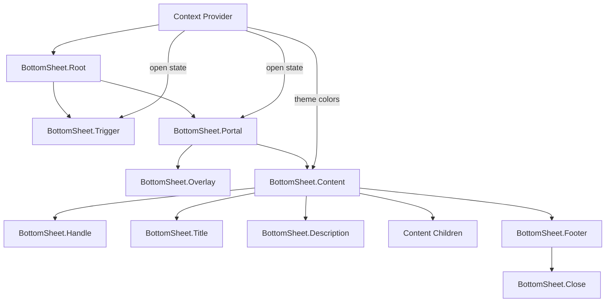

# BottomSheet Component Plan

## Overview

This document outlines the implementation plan for a BottomSheet component in `@radix-ui/themes-native`. The BottomSheet will follow the existing compound component pattern used by Dialog and AlertDialog, while being designed for extensibility.

## Goals

1. **Consistency**: Match the API patterns of existing overlay components (Dialog, AlertDialog)
2. **Simplicity**: Start with basic features, minimal dependencies
3. **Extensibility**: Design the API to support future enhancements (gestures, keyboard handling)
4. **Native Feel**: Follow iOS/Android bottom sheet conventions

## Proposed API

### Compound Component Structure

```tsx
import { BottomSheet } from '@radix-ui/themes-native';

// Basic usage
<BottomSheet.Root>
  <BottomSheet.Trigger>
    <Button>Open Sheet</Button>
  </BottomSheet.Trigger>
  <BottomSheet.Portal>
    <BottomSheet.Overlay />
    <BottomSheet.Content snapPoints={['25%', '50%', '90%']}>
      <BottomSheet.Handle />
      <BottomSheet.Title>Sheet Title</BottomSheet.Title>
      <BottomSheet.Description>Sheet description text.</BottomSheet.Description>
      {/* Scrollable content */}
      <BottomSheet.Footer>
        <BottomSheet.Close>
          <Button>Cancel</Button>
        </BottomSheet.Close>
        <Button>Confirm</Button>
      </BottomSheet.Footer>
    </BottomSheet.Content>
  </BottomSheet.Portal>
</BottomSheet.Root>
```

### Convenience Component

For simpler use cases:

```tsx
<BottomSheet
  open={isOpen}
  onOpenChange={setIsOpen}
  title="Sheet Title"
  description="Optional description"
  snapPoints={['50%']}
>
  {/* Content */}
</BottomSheet>
```

## Component Details

### BottomSheet.Root

| Prop | Type | Default | Description |
|------|------|---------|-------------|
| `open` | `boolean` | `false` | Controlled open state |
| `onOpenChange` | `(open: boolean) => void` | - | Callback when open state changes |
| `defaultSnapPoint` | `number` | `0` | Initial snap point index |

### BottomSheet.Trigger

| Prop | Type | Default | Description |
|------|------|---------|-------------|
| `children` | `ReactNode` | - | Trigger element |
| `asChild` | `boolean` | `true` | Merge props onto child element |

### BottomSheet.Portal

Uses React Native's `Modal` component (same as Dialog).

| Prop | Type | Default | Description |
|------|------|---------|-------------|
| `children` | `ReactNode` | - | Portal content |
| `hostId` | `string` | - | Optional portal host ID |

### BottomSheet.Overlay

| Prop | Type | Default | Description |
|------|------|---------|-------------|
| `style` | `StyleProp<ViewStyle>` | - | Custom styles |
| `blur` | `boolean` | `false` | Future: backdrop blur effect |

### BottomSheet.Content

| Prop | Type | Default | Description |
|------|------|---------|-------------|
| `children` | `ReactNode` | - | Sheet content |
| `snapPoints` | `(string \| number)[]` | `['50%']` | Height snap points |
| `style` | `StyleProp<ViewStyle>` | - | Custom styles |
| `size` | `1 \| 2 \| 3 \| 4` | `2` | Padding size |
| `hideHandle` | `boolean` | `false` | Hide drag handle |

### BottomSheet.Handle

Visual drag handle at the top of the sheet.

| Prop | Type | Default | Description |
|------|------|---------|-------------|
| `style` | `StyleProp<ViewStyle>` | - | Custom styles |

### BottomSheet.Title

Extends `Heading` component props.

### BottomSheet.Description

Extends `Text` component props.

### BottomSheet.Close

| Prop | Type | Default | Description |
|------|------|---------|-------------|
| `children` | `ReactNode` | - | Close trigger element |
| `asChild` | `boolean` | `true` | Merge props onto child element |

### BottomSheet.Footer

A sticky footer that remains fixed at the bottom of the sheet, useful for action buttons.

| Prop | Type | Default | Description |
|------|------|---------|-------------|
| `children` | `ReactNode` | - | Footer content (typically buttons) |
| `style` | `StyleProp<ViewStyle>` | - | Custom styles |
| `withBorder` | `boolean` | `true` | Show top border separator |
| `withPadding` | `boolean` | `true` | Apply theme padding |

## Architecture Diagram



## Implementation Details

### State Management

Following the Dialog pattern:
- Context-based state management
- Controlled and uncontrolled modes
- Theme-aware styling

### Animation

For the initial implementation:
- Use React Native's `Animated` API
- Slide-up/slide-down animations
- Snap point transitions

```tsx
// Animation approach
const translateY = useRef(new Animated.Value(screenHeight)).current;

const animateToSnapPoint = (index: number) => {
  const targetY = screenHeight - snapPointHeights[index];
  Animated.spring(translateY, {
    toValue: targetY,
    useNativeDriver: true,
    tension: 65,
    friction: 11,
  }).start();
};
```

### Snap Points

Support both percentage and fixed values:
- `'25%'` - 25% of screen height
- `'50%'` - 50% of screen height  
- `300` - Fixed 300px height

### Theme Integration

Use existing theme system:
- Background colors from `theme.colors.gray`
- Border radius from `theme.radii`
- Shadows from `getShadow()`
- Spacing from `theme.space`

## File Structure

```
packages/radix-ui-themes-native/src/components/overlays/
├── BottomSheet.tsx          # Main component file
├── index.ts                 # Add exports
└── ...

apps/playground-native/app/demo/bottom_sheet/
└── index.tsx                # Demo page

docs/components/overlays/
└── bottom-sheet.mdx         # Documentation
```

## Future Enhancements

These are planned for future iterations:

1. **Gesture Handling**: Add `react-native-gesture-handler` for drag interactions
2. **Keyboard Handling**: Automatic adjustment when keyboard appears
3. **Dynamic Snapping**: Velocity-based snap point selection
4. **Backdrop Blur**: Native blur effect for overlay
5. **Nested Scrolling**: Proper scroll locking inside sheet content

## Dependencies

### Current (No new dependencies)
- `react-native` (built-in Modal, Animated)
- Existing theme system

### Future (Optional)
- `react-native-gesture-handler` - For gesture-based interactions
- `react-native-reanimated` - For smoother animations
- `@react-native-community/blur` - For backdrop blur

## Implementation Steps

1. Create `BottomSheet.tsx` with context and compound components
2. Implement basic slide-up animation with snap points
3. Add drag handle component
4. Export from `overlays/index.ts`
5. Create demo page in playground app
6. Write documentation

## Questions to Consider

1. Should we support horizontal BottomSheets (side panels) in the future?
2. What should be the default animation duration?
3. Should the overlay close on tap by default?
4. Do we need a `BottomSheet.Footer` component for sticky footers?

---

**Status**: Ready for review
**Next Step**: Switch to Code mode for implementation after plan approval
