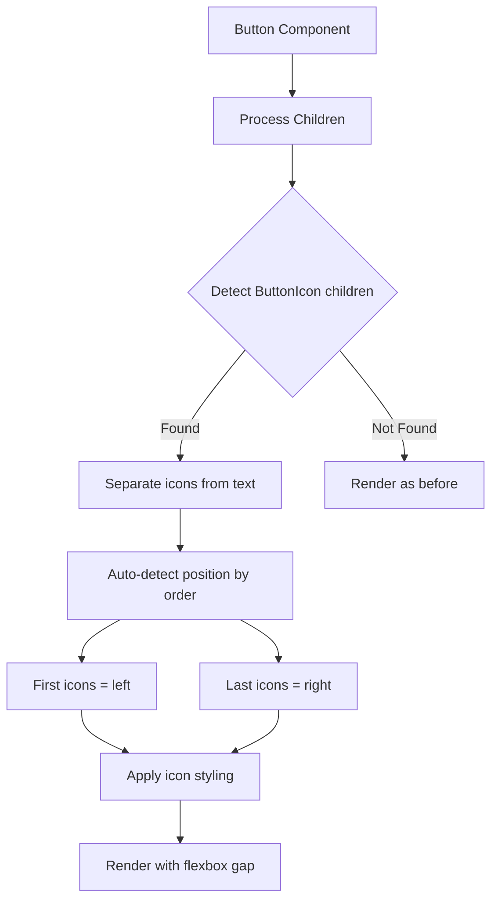

# Button.Icon Compound Component Implementation Plan

## Overview

Add a `Button.Icon` compound component to the existing Button component that allows users to pass icons with automatic positioning based on child order and proper styling (size, color, gap).

## Proposed API

```tsx
// Icon appears before text (left position)
<Button>
  <Button.Icon>
    <PlusIcon />
  </Button.Icon>
  Add Item
</Button>

// Icon appears after text (right position)
<Button>
  Next
  <Button.Icon>
    <ChevronIcon />
  </Button.Icon>
</Button>

// Multiple icons supported
<Button>
  <Button.Icon>
    <LeftIcon />
  </Button.Icon>
  Go Back
  <Button.Icon>
    <RightIcon />
  </Button.Icon>
</Button>

// Flexible content (not just icons)
<Button>
  <Button.Icon>
    <Avatar size="1" src="..." />
  </Button.Icon>
  User Profile
  <Button.Icon>
    <ChevronIcon />
  </Button.Icon>
</Button>
```

## Architecture

### Component Structure



### Type Definitions

```typescript
interface ButtonIconProps {
  /**
   * Icon or content to render
   */
  children: React.ReactNode;
  /**
   * Optional style overrides
   */
  style?: ViewStyle;
}

interface ButtonCompoundComponent extends React.ForwardRefExoticComponent<ButtonProps> {
  Icon: typeof ButtonIcon;
}
```

## Implementation Details

### 1. ButtonIcon Component

Create a simple wrapper component that:
- Accepts `children` prop for the icon/content
- Has a `displayName` for detection
- Is essentially a marker component that the parent Button will process

```typescript jsx
const ButtonIcon = React.forwardRef<View, ButtonIconProps>(
  ({ children, style, ...props }, ref) => {
    // This component is primarily a marker
    // The actual rendering is handled by the parent Button
    return (
      <View ref={ref} style={style} {...props}>
        {children}
      </View>
    );
  }
);

ButtonIcon.displayName = 'ButtonIcon';
```

### 2. Button Component Modifications

Modify the main Button component to:

1. **Detect ButtonIcon children** using `Children.forEach` and checking `displayName`
2. **Separate icons from text content** into left and right arrays
3. **Auto-detect positioning** based on child order:
   - Icons before text content → left position
   - Icons after text content → right position
4. **Apply icon styling**:
   - Size based on button `size` prop (16px, 20px, 24px for sizes 1, 2, 3)
   - Color based on variant colors (same as text color)
   - Use `React.cloneElement` to inject props (similar to IconButton pattern)

### 3. Icon Sizing Logic

Based on existing [`IconButton.tsx`](packages/radix-ui-themes-native/src/components/forms/IconButton.tsx:135) pattern:

| Button Size | Icon Size |
|-------------|-----------|
| 1           | 16px      |
| 2           | 20px      |
| 3           | 24px      |

### 4. Icon Coloring Logic

Use the same `variantColors.textColor` that's applied to button text, ensuring icons match the text color for each variant:

- **classic/solid**: Uses contrast color
- **soft/outline/surface/ghost**: Uses alpha-11 color

### 5. Layout Structure

The button already has `flexDirection: 'row'`, `alignItems: 'center'`, and `gap: theme.space[2]`. The new render structure will be:

```tsx
<TouchableOpacity style={buttonStyle}>
  {loading ? (
    <ActivityIndicator />
  ) : (
    <>
      {/* Left icons */}
      {leftIcons}
      
      {/* Text content */}
      {textContent && <Text style={textStyle}>{textContent}</Text>}
      
      {/* Right icons */}
      {rightIcons}
    </>
  )}
</TouchableOpacity>
```

## Files to Modify

### Primary Changes

1. **[`packages/radix-ui-themes-native/src/components/forms/Button.tsx`](packages/radix-ui-themes-native/src/components/forms/Button.tsx)**
   - Add `ButtonIcon` component definition
   - Add `ButtonIconProps` interface
   - Modify Button component to process children
   - Add compound component attachment (`Button.Icon = ButtonIcon`)
   - Update exports

### Secondary Changes

2. **[`packages/radix-ui-themes-native/src/components/forms/index.ts`](packages/radix-ui-themes-native/src/components/forms/index.ts)**
   - Export `ButtonIcon` type if needed

3. **[`apps/playground-native/app/demo/buttons/index.tsx`](apps/playground-native/app/demo/buttons/index.tsx)**
   - Add usage examples demonstrating the new API

## Implementation Steps

1. **Add ButtonIcon interface and component**
   - Define `ButtonIconProps` interface
   - Create `ButtonIcon` forwardRef component with displayName

2. **Modify Button component children processing**
   - Import `Children` and `isValidElement` from React
   - Add logic to detect and separate ButtonIcon children
   - Determine text content vs icon children
   - Auto-detect left/right positioning

3. **Apply icon styling**
   - Create icon size mapping based on button size
   - Use `React.cloneElement` to inject size and color props
   - Handle disabled state for icons

4. **Update render output**
   - Render icons in correct positions with text in between
   - Maintain existing gap styling

5. **Attach compound component**
   - Add `Button.Icon = ButtonIcon` after component definition
   - Update TypeScript type as `ButtonCompoundComponent`

6. **Add demo examples**
   - Left icon button
   - Right icon button
   - Both sides icon button
   - Icon-only button (edge case)

## Edge Cases to Handle

1. **Icon-only button** (no text content)
   - Should still work, just render icons

2. **Multiple icons on same side**
   - Support multiple Button.Icon children

3. **Loading state**
   - Icons should be hidden during loading (like text)

4. **Disabled state**
   - Icons should inherit disabled opacity/color

5. **Backward compatibility**
   - Existing string children should work as before
   - No breaking changes to current API

## Testing Considerations

- Verify icon positioning with different child orders
- Test all button variants with icons
- Test all button sizes with icons
- Test disabled and loading states
- Test icon-only buttons
- Verify accessibility (icons should be decorative when paired with text)

## References

- Existing compound component pattern: [`TextField.tsx`](packages/radix-ui-themes-native/src/components/forms/TextField.tsx:502)
- Icon handling pattern: [`IconButton.tsx`](packages/radix-ui-themes-native/src/components/forms/IconButton.tsx:186)
- Color helpers: [`color-helpers.ts`](packages/radix-ui-themes-native/src/theme/color-helpers.ts)
