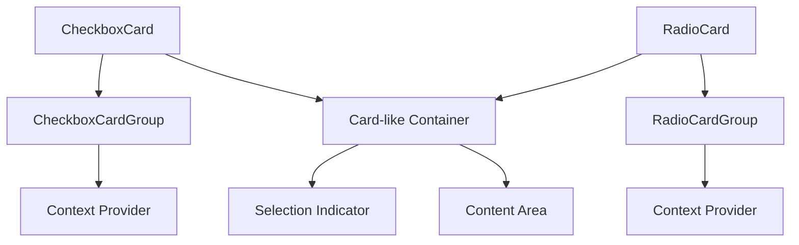

# CheckboxCard and RadioCard Implementation Plan

## Overview

This plan outlines the implementation of `CheckboxCard`, `RadioCard`, `CheckboxCardGroup`, and `RadioCardGroup` components for radix-ui-themes-native. These components combine the visual appearance of a Card with the functionality of Checkbox/Radio selection.

## Reference

Based on Radix UI's web implementation:
- Checkbox Cards: https://www.radix-ui.com/themes/docs/components/checkbox-cards
- Radio Cards: https://www.radix-ui.com/themes/docs/components/radio-cards

## Component Architecture

### Component Hierarchy



### Props Interface

#### CheckboxCard Props

```typescript
interface CheckboxCardProps {
  // Selection state
  checked?: boolean;
  defaultChecked?: boolean;
  onCheckedChange?: (checked: boolean) => void;
  
  // Card appearance
  variant?: 'solid' | 'soft' | 'surface' | 'outline';
  size?: '1' | '2' | '3';
  color?: Color;
  highContrast?: boolean;
  radius?: RadiusSize;
  
  // State
  disabled?: boolean;
  indeterminate?: boolean;
  
  // Content
  children?: ReactNode;
  value?: string; // For use within CheckboxCardGroup
  
  // Accessibility
  accessibilityLabel?: string;
  accessibilityHint?: string;
}
```

#### RadioCard Props

```typescript
interface RadioCardProps {
  // Selection state
  value: string;
  selected?: boolean;
  onSelect?: (value: string) => void;
  defaultChecked?: boolean;
  
  // Card appearance
  variant?: 'solid' | 'soft' | 'surface' | 'outline';
  size?: '1' | '2' | '3';
  color?: Color;
  highContrast?: boolean;
  radius?: RadiusSize;
  
  // State
  disabled?: boolean;
  
  // Content
  children?: ReactNode;
  
  // Accessibility
  accessibilityLabel?: string;
  accessibilityHint?: string;
}
```

#### CheckboxCardGroup Props

```typescript
interface CheckboxCardGroupProps {
  // Selection state
  value?: string[];
  defaultValue?: string[];
  onValueChange?: (value: string[]) => void;
  
  // Appearance - applies to all children
  variant?: 'solid' | 'soft' | 'surface' | 'outline';
  size?: '1' | '2' | '3';
  color?: Color;
  highContrast?: boolean;
  radius?: RadiusSize;
  
  // Layout
  direction?: 'row' | 'column';
  gap?: number;
  
  // State
  disabled?: boolean;
  
  // Content
  children: ReactNode;
}
```

#### RadioCardGroup Props

```typescript
interface RadioCardGroupProps {
  // Selection state
  value?: string;
  defaultValue?: string;
  onValueChange?: (value: string) => void;
  
  // Appearance - applies to all children
  variant?: 'solid' | 'soft' | 'surface' | 'outline';
  size?: '1' | '2' | '3';
  color?: Color;
  highContrast?: boolean;
  radius?: RadiusSize;
  
  // Layout
  direction?: 'row' | 'column';
  gap?: number;
  
  // State
  disabled?: boolean;
  
  // Content
  children: ReactNode;
}
```

## Visual Design

### Card Appearance

The card should have:
1. **Container**: Rounded corners with configurable radius
2. **Border**: Visible border that changes color on selection
3. **Background**: Changes based on variant and selection state
4. **Selection Indicator**: Checkbox or Radio indicator in the corner or alongside content
5. **Content Area**: Flexible area for custom content

### Selection States

| State | Unselected | Selected |
|-------|------------|----------|
| Default | Gray border, transparent/light bg | Accent border, accent bg tint |
| Hover | Slightly darker border | Maintained accent styling |
| Disabled | Reduced opacity | Reduced opacity |
| High Contrast | More prominent border | Stronger accent colors |

### Size Variants

| Size | Padding | Border Radius | Indicator Size |
|------|---------|---------------|----------------|
| 1 | 12px | small | 18px |
| 2 | 16px | medium | 22px |
| 3 | 20px | large | 28px |

## Implementation Details

### File Structure

```
packages/radix-ui-themes-native/src/components/forms/
├── CheckboxCard.tsx      # CheckboxCard component
├── CheckboxCardGroup.tsx # CheckboxCardGroup component
├── RadioCard.tsx         # RadioCard component
├── RadioCardGroup.tsx    # RadioCardGroup component
└── index.ts              # Updated exports
```

### Context for Groups

Both group components will use React Context to pass down:
- Current selection state
- Shared appearance props
- Disabled state
- Change handlers

```typescript
// CheckboxCardGroup Context
interface CheckboxCardGroupContextValue {
  value: string[];
  onValueChange: (value: string[]) => void;
  variant: 'solid' | 'soft' | 'surface' | 'outline';
  size: '1' | '2' | '3';
  color?: Color;
  highContrast: boolean;
  radius: RadiusSize;
  disabled: boolean;
}

// RadioCardGroup Context
interface RadioCardGroupContextValue {
  value: string;
  onValueChange: (value: string) => void;
  variant: 'solid' | 'soft' | 'surface' | 'outline';
  size: '1' | '2' | '3';
  color?: Color;
  highContrast: boolean;
  radius: RadiusSize;
  disabled: boolean;
}
```

### Compound Component Pattern

Consider using compound components for better flexibility:

```typescript
// Potential future enhancement
<CheckboxCard>
  <CheckboxCard.Indicator />
  <CheckboxCard.Content>
    <CheckboxCard.Title>Option Title</CheckboxCard.Title>
    <CheckboxCard.Description>Description text</CheckboxCard.Description>
  </CheckboxCard.Content>
</CheckboxCard>
```

For the initial implementation, we'll keep it simple with a single component that accepts children.

## Accessibility

### CheckboxCard Accessibility

- `accessibilityRole`: "checkbox"
- `accessibilityState`: `{ checked: boolean | 'mixed', disabled: boolean }`
- `accessibilityActions`: `[{ name: 'activate', label: 'Toggle' }]`

### RadioCard Accessibility

- `accessibilityRole`: "radio"
- `accessibilityState`: `{ checked: boolean, disabled: boolean }`
- `accessibilityActions`: `[{ name: 'activate', label: 'Select' }]`

### RadioCardGroup Accessibility

- `accessibilityRole`: "radiogroup"

## Implementation Steps

### Step 1: Create CheckboxCards Component
- Create `CheckboxCards.tsx`
- Implement `CheckboxCardsRoot` component with context provider
- Implement `CheckboxCardsItem` component with:
  - Card container with selection styling
  - Built-in checkbox indicator (positioned via `side` prop)
  - Support for controlled and uncontrolled modes via context
  - Handle disabled state
- Create context for sharing state between Root and Item

### Step 2: Create RadioCards Component
- Create `RadioCards.tsx`
- Implement `RadioCardsRoot` component with context provider
- Implement `RadioCardsItem` component with:
  - Card container with selection styling
  - Built-in radio indicator (positioned via `side` prop)
  - Support for controlled and uncontrolled modes via context
  - Handle disabled state
- Create context for sharing state between Root and Item

### Step 3: Update Exports
- Update `forms/index.ts` with new exports:
  - `CheckboxCards`, `CheckboxCardsRoot`, `CheckboxCardsItem`
  - `RadioCards`, `RadioCardsRoot`, `RadioCardsItem`
- Export all relevant types

### Step 4: Create Demo Pages
- Create `apps/playground-native/app/demo/checkbox_cards/index.tsx`
- Create `apps/playground-native/app/demo/radio_cards/index.tsx`
- Add routes to demo navigation

## File Structure

```
packages/radix-ui-themes-native/src/components/forms/
├── CheckboxCards.tsx     # CheckboxCards Root and Item components
├── RadioCards.tsx        # RadioCards Root and Item components
└── index.ts              # Updated exports

apps/playground-native/app/demo/
├── checkbox_cards/
│   └── index.tsx         # CheckboxCards demo
├── radio_cards/
│   └── index.tsx         # RadioCards demo
└── _layout.tsx           # Updated with new routes
```

## Testing Considerations

1. **Selection State**: Verify controlled and uncontrolled modes work correctly
2. **Group Behavior**: Test that groups properly manage selection state
3. **Accessibility**: Verify screen reader compatibility
4. **Theming**: Test all color variants and high contrast modes
5. **Disabled State**: Ensure disabled cards don't respond to interaction
6. **Layout**: Test row and column layouts for groups

## Dependencies

- Existing theme hooks: `useTheme`, `useThemeMode`
- Color helpers: `getVariantColors`, `getAccentColor`, `getGrayAlpha`, `getContrast`
- Primitives: `View`, `TouchableOpacity`
- Existing components: `Text` for labels

## Design Decisions

Based on discussion, following the Radix UI web pattern:

1. **Component Naming**: `CheckboxCards` and `RadioCards` (plural, matching Radix UI web)
2. **Compound Component Pattern**: Root/Item structure
3. **Built-in Indicator**: Indicator is automatically rendered, no need for explicit component
4. **Indicator Position**: Right side by default, configurable via `side` prop on Item

### Compound Component Structure

```tsx
// CheckboxCards compound components
<CheckboxCards.Root defaultValue={["1"]}>
  <CheckboxCards.Item value="1">
    <Flex direction="column" width="100%">
      <Text weight="bold">A1 Keyboard</Text>
      <Text>US Layout</Text>
    </Flex>
  </CheckboxCards.Item>
  <CheckboxCards.Item value="2">
    <Flex direction="column" width="100%">
      <Text weight="bold">Pro Mouse</Text>
      <Text>Zero-lag wireless</Text>
    </Flex>
  </CheckboxCards.Item>
</CheckboxCards.Root>

// RadioCards compound components
<RadioCards.Root defaultValue="1">
  <RadioCards.Item value="1">
    <Flex direction="column" width="100%">
      <Text weight="bold">A1 Keyboard</Text>
      <Text>US Layout</Text>
    </Flex>
  </RadioCards.Item>
  <RadioCards.Item value="2">
    <Flex direction="column" width="100%">
      <Text weight="bold">Pro Mouse</Text>
      <Text>Zero-lag wireless</Text>
    </Flex>
  </RadioCards.Item>
</RadioCards.Root>
```

### Props Interface

#### CheckboxCards.Root Props

```typescript
interface CheckboxCardsRootProps {
  // Selection state
  value?: string[];
  defaultValue?: string[];
  onValueChange?: (value: string[]) => void;
  
  // Appearance - applies to all children
  variant?: 'solid' | 'soft' | 'surface' | 'outline';
  size?: '1' | '2' | '3';
  color?: Color;
  highContrast?: boolean;
  radius?: RadiusSize;
  
  // Layout
  direction?: 'row' | 'column';
  gap?: number;
  side?: 'left' | 'right'; // Indicator position for all children, default: 'right'
  
  // State
  disabled?: boolean;
  
  // Content
  children: ReactNode;
}
```

#### CheckboxCards.Item Props

```typescript
interface CheckboxCardsItemProps {
  // Required value for identification
  value: string;
  
  // Indicator position override (overrides Root's side prop)
  side?: 'left' | 'right';
  
  // Individual disabled state
  disabled?: boolean;
  
  // Content
  children?: ReactNode;
  
  // Accessibility
  accessibilityLabel?: string;
  accessibilityHint?: string;
}
```

#### RadioCards.Root Props

```typescript
interface RadioCardsRootProps {
  // Selection state
  value?: string;
  defaultValue?: string;
  onValueChange?: (value: string) => void;
  
  // Appearance - applies to all children
  variant?: 'solid' | 'soft' | 'surface' | 'outline';
  size?: '1' | '2' | '3';
  color?: Color;
  highContrast?: boolean;
  radius?: RadiusSize;
  
  // Layout
  direction?: 'row' | 'column';
  gap?: number;
  side?: 'left' | 'right'; // Indicator position for all children, default: 'right'
  
  // State
  disabled?: boolean;
  
  // Content
  children: ReactNode;
}
```

#### RadioCards.Item Props

```typescript
interface RadioCardsItemProps {
  // Required value for identification
  value: string;
  
  // Indicator position override (overrides Root's side prop)
  side?: 'left' | 'right';
  
  // Individual disabled state
  disabled?: boolean;
  
  // Content
  children?: ReactNode;
  
  // Accessibility
  accessibilityLabel?: string;
  accessibilityHint?: string;
}
