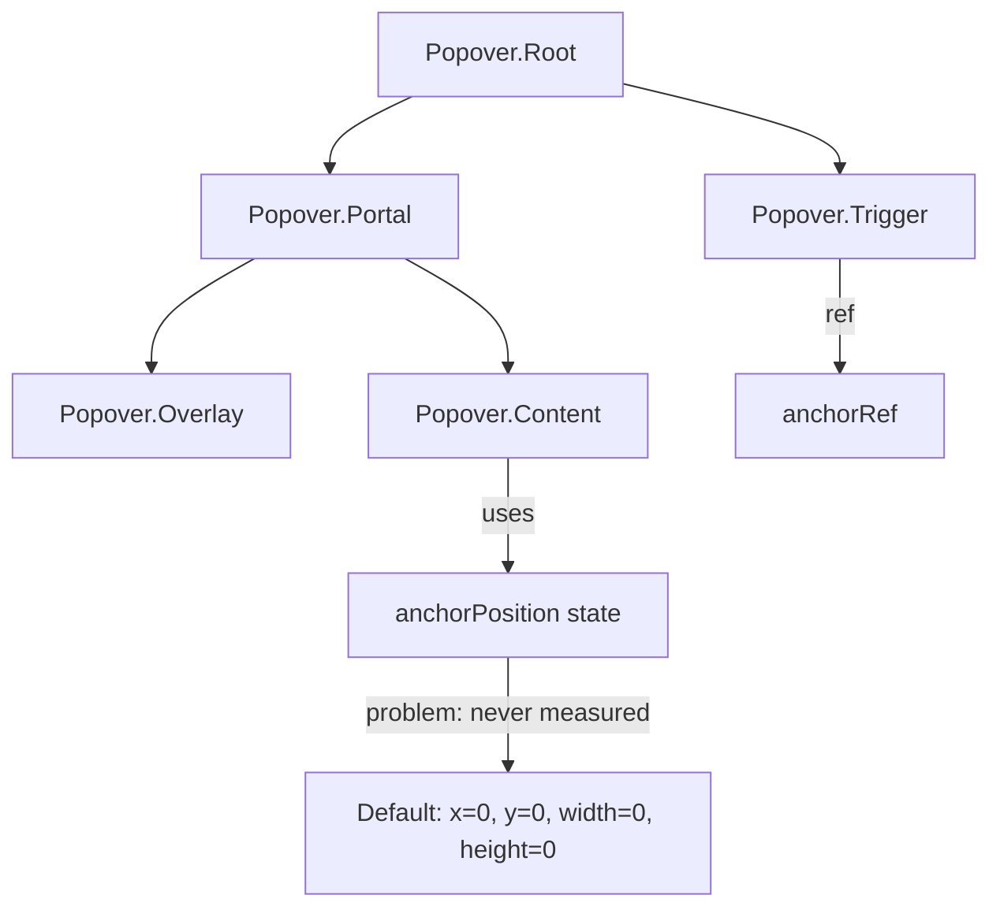
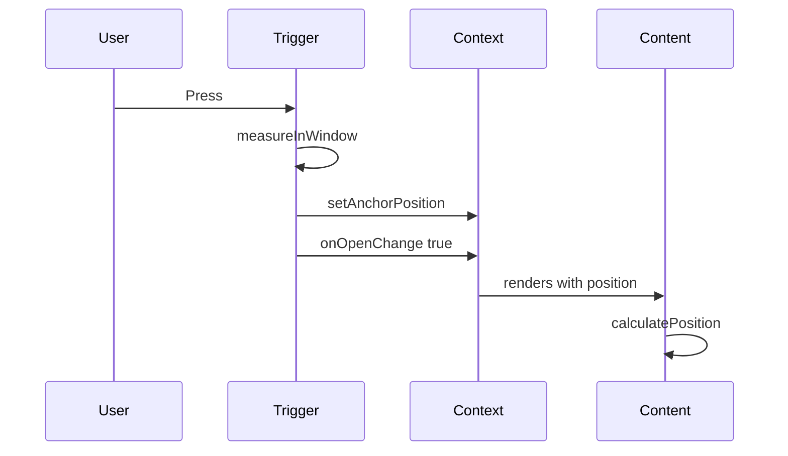
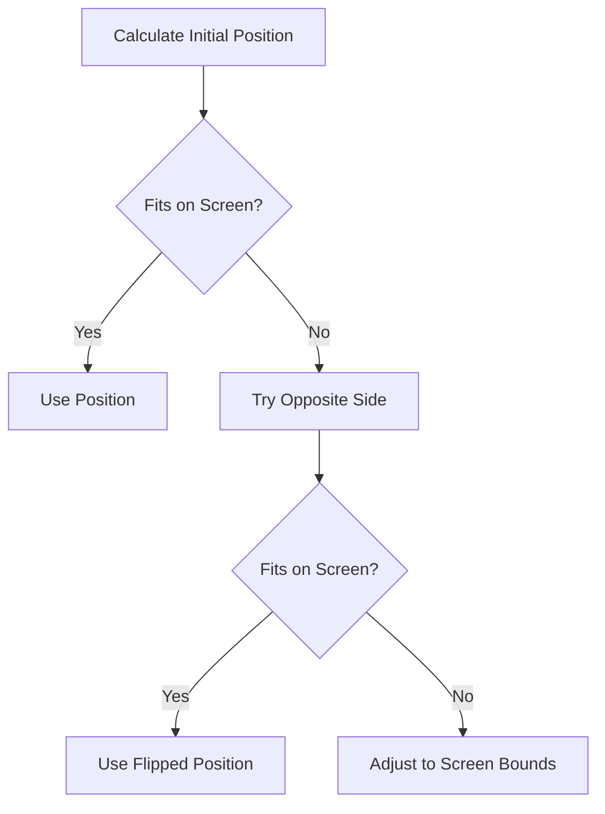

# Popover Anchor Positioning Implementation Plan

## Problem Statement

The current Popover component in [`Popover.tsx`](../packages/radix-ui-themes-native/src/components/overlays/Popover.tsx:193-194) has a placeholder implementation for anchor-based positioning. The comment indicates:

```typescript
// In React Native, we position the content absolutely based on anchor
// For simplicity, we'll use a centered approach with side-based positioning
```

The current implementation:
- Initializes `anchorPosition` state but never measures the actual trigger element
- Uses hardcoded position values instead of actual trigger measurements
- Does not properly implement `side` and `align` props
- Lacks collision detection and avoidance

## Current Architecture Analysis

### Component Structure



### Key Components

1. **PopoverRoot** - Manages open/close state and provides context
2. **PopoverTrigger** - Should capture anchor measurements when pressed
3. **PopoverContent** - Should position relative to anchor based on `side` and `align`

## Implementation Plan

### Phase 1: Create Anchor Measurement Hook

Create a reusable hook to measure trigger element position:

```typescript
// packages/radix-ui-themes-native/src/hooks/useAnchorPosition.ts

interface AnchorPosition {
  x: number;
  y: number;
  width: number;
  height: number;
}

interface UseAnchorPositionReturn {
  anchorRef: React.RefObject<View>;
  anchorPosition: AnchorPosition;
  measureAnchor: () => void;
}
```

**Implementation Details:**
- Use `measureInWindow()` API to get absolute coordinates
- Store measurements in state
- Provide a function to trigger measurement on press

### Phase 2: Update PopoverTrigger

Modify [`PopoverTrigger`](../packages/radix-ui-themes-native/src/components/overlays/Popover.tsx:95-117) to:

1. Accept and store a ref to the trigger element
2. Measure trigger position when pressed
3. Pass measurements to context



### Phase 3: Update PopoverContent Positioning

Modify [`PopoverContent`](../packages/radix-ui-themes-native/src/components/overlays/Popover.tsx:178-271) to:

1. Use anchor position from context
2. Calculate position based on `side` prop:
   - **top**: Position above the anchor
   - **bottom**: Position below the anchor
   - **left**: Position to the left of the anchor
   - **right**: Position to the right of the anchor

3. Calculate alignment based on `align` prop:
   - **start**: Align to the start edge of the anchor
   - **center**: Center relative to the anchor
   - **end**: Align to the end edge of the anchor

4. Apply `sideOffset` and `alignOffset`

### Phase 4: Implement Collision Detection

Add collision detection to prevent popover from rendering off-screen:



**Collision Logic:**
1. Check if content would overflow screen bounds
2. If `avoidCollisions` is true, flip to opposite side
3. If still doesn't fit, clamp to screen edges

### Phase 5: Content Size Measurement

Measure the content size to enable accurate positioning:

1. Use `onLayout` on content container
2. Store content size in ref
3. Recalculate position when content size changes

## Technical Implementation Details

### Position Calculation Algorithm

```typescript
interface Position {
  top?: number;
  bottom?: number;
  left?: number;
  right?: number;
}

function calculatePosition(
  anchor: AnchorPosition,
  content: { width: number; height: number },
  screen: { width: number; height: number },
  side: PopoverSide,
  align: PopoverAlign,
  sideOffset: number,
  alignOffset: number
): Position {
  // Implementation based on side and align
}
```

### Side Positioning

| Side | Top/Bottom Calculation | Left/Right Calculation |
|------|------------------------|------------------------|
| top | `anchor.y - content.height - sideOffset` | Based on align |
| bottom | `anchor.y + anchor.height + sideOffset` | Based on align |
| left | Based on align | `anchor.x - content.width - sideOffset` |
| right | Based on align | `anchor.x + anchor.width + sideOffset` |

### Align Positioning

| Align | Horizontal Side (top/bottom) | Vertical Side (left/right) |
|-------|------------------------------|----------------------------|
| start | `anchor.x + alignOffset` | `anchor.y + alignOffset` |
| center | `anchor.x + (anchor.width - content.width) / 2 + alignOffset` | `anchor.y + (anchor.height - content.height) / 2 + alignOffset` |
| end | `anchor.x + anchor.width - content.width + alignOffset` | `anchor.y + anchor.height - content.height + alignOffset` |

## Files to Modify

1. **[`Popover.tsx`](../packages/radix-ui-themes-native/src/components/overlays/Popover.tsx)**
   - Update `PopoverTrigger` to measure anchor position
   - Update `PopoverContent` to use anchor position for placement
   - Add collision detection logic

2. **Create new hook (optional but recommended)**
   - `src/hooks/useAnchorPosition.ts` - Reusable anchor measurement hook

3. **Update context interface**
   - Add `anchorPosition` and `setAnchorPosition` to context

## Testing Strategy

1. Test each `side` value (top, bottom, left, right)
2. Test each `align` value (start, center, end)
3. Test `sideOffset` and `alignOffset`
4. Test collision detection at screen edges
5. Test with different trigger sizes
6. Test with different content sizes

## Dependencies

No new external dependencies required. Uses React Native built-in:
- `measureInWindow()` - For measuring element position
- `onLayout` - For measuring element dimensions
- `Dimensions` API - For screen size

## Risks and Considerations

1. **Performance**: Measuring on every press could be expensive. Consider caching.
2. **Layout Changes**: If layout changes while popover is open, position may be stale.
3. **Keyboard**: On iOS/Android, keyboard appearance may affect positioning.
4. **Safe Areas**: Consider safe area insets when positioning near edges.

## Implementation Order

1. [ ] Create `useAnchorPosition` hook
2. [ ] Update `PopoverTrigger` to measure and store anchor position
3. [ ] Update `PopoverContent` to calculate position based on anchor
4. [ ] Implement collision detection
5. [ ] Test with demo app
6. [ ] Consider applying same pattern to DropdownMenu (optional)
