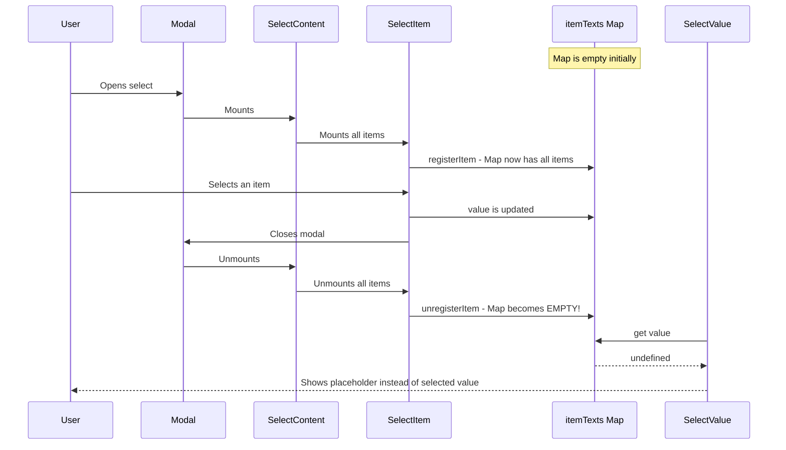

# Select.Value Display Fix Plan

## Problem Summary

When a `defaultValue` is set on `Select.Root`, the `Select.Value` correctly displays the default value initially. However, when the user selects an item from the dropdown, the `Select.Value` switches to showing the placeholder instead of the newly selected value.

## Root Cause Analysis

The bug is caused by the item registration/unregistration lifecycle in [`SelectItem`](packages/radix-ui-themes-native/src/components/forms/Select.tsx:525):

```tsx
// Line 536-553 in SelectItem component
React.useEffect(() => {
  const text = extractText(children);
  registerItem(itemValue, text);
  return () => unregisterItem(itemValue);  // <-- Problem: unregisters on unmount
}, [children, itemValue, registerItem, unregisterItem]);
```

### Bug Flow Sequence



### Key Issue

When the Modal closes:
1. `SelectContent` unmounts
2. All `SelectItem` components unmount
3. Each `SelectItem` calls `unregisterItem` in its cleanup effect
4. The `itemTexts` Map becomes empty
5. `Select.Value` cannot find the text for the current value, so it shows the placeholder

## Solution

The fix requires persisting the selected item text independently from the `itemTexts` Map, so it remains available even when the dropdown is closed.

### Approach: Use `selectedItemText` State

The context already has `selectedItemText` and `setSelectedItemText` state (line 155), but they are not being used correctly. The fix involves:

1. **In `SelectItem`**: When an item is selected, call `setSelectedItemText` to store the text
2. **In `SelectValue`**: Use `selectedItemText` as the primary source for display text

### Implementation Details

#### Step 1: Update `SelectItem` to Set Selected Text

In the `handlePress` function of `SelectItem`, add a call to set the selected item text:

```tsx
// In SelectItem component
const { value, onValueChange, colors, onOpenChange, size, registerItem, unregisterItem, selectedItemText, setSelectedItemText } = useSelect();

const handlePress = () => {
  if (!disabled) {
    // Extract text and store it before changing value
    const extractText = (node: ReactNode): string => {
      if (typeof node === 'string') return node;
      if (typeof node === 'number') return String(node);
      if (!node) return '';
      if (Array.isArray(node)) return node.map(extractText).join('');
      if (React.isValidElement(node) && node.props.children) {
        return extractText(node.props.children);
      }
      return '';
    };
    const text = extractText(children);
    setSelectedItemText(text);
    onValueChange(itemValue);
  }
};
```

#### Step 2: Update `SelectValue` to Use `selectedItemText`

```tsx
export const SelectValue = ({ placeholder = 'Select an option', style }: SelectValueProps) => {
  const { value, itemTexts, selectedItemText, colors } = useSelect();

  // Priority: selectedItemText > itemTexts lookup > placeholder
  const selectedText = selectedItemText || (value ? itemTexts.get(value) : undefined);

  return (
    <Text style={[
      { color: selectedText ? colors[12] : colors[9] },
      style || {}
    ]}>
      {selectedText || placeholder}
    </Text>
  );
};
```

#### Step 3: Initialize `selectedItemText` from `defaultValue`

In `SelectRoot`, when there's a `defaultValue`, we need to look up its text from the `itemTexts` Map after items are registered:

```tsx
// In SelectRoot - add effect to sync selectedItemText with defaultValue
React.useEffect(() => {
  if (defaultValue && itemTexts.size > 0) {
    const text = itemTexts.get(defaultValue);
    if (text && !selectedItemText) {
      setSelectedItemText(text);
    }
  }
}, [defaultValue, itemTexts, selectedItemText]);
```

## Files to Modify

- [`packages/radix-ui-themes-native/src/components/forms/Select.tsx`](packages/radix-ui-themes-native/src/components/forms/Select.tsx)

## Testing

After implementing the fix, test the following scenarios:

1. **Uncontrolled with defaultValue**: Select with `defaultValue="carrot"` should display "Carrot" initially, and when selecting a different item, it should update to show the new selection
2. **Controlled mode**: Select with `value` and `onValueChange` should correctly display the selected value
3. **No default value**: Select without `defaultValue` should show placeholder until an item is selected
4. **Groups**: Select with grouped items should work correctly
5. **Disabled items**: Disabled items should not affect the selection behavior

## Summary

The fix ensures that `Select.Value` always has access to the selected item's text by:
1. Storing the text in `selectedItemText` state when an item is selected
2. Using `selectedItemText` as the primary source in `Select.Value`
3. Initializing `selectedItemText` from `defaultValue` when available

This approach decouples the display text from the `itemTexts` Map, which gets cleared when the modal closes.
