# TextField Root Component Deduplication Plan

## Current Issue

The `TextFieldRoot` component has significant duplication in the TextInput rendering logic (lines 426-470):

**Branch 1 - User-provided TextInput (lines 428-448):**
```tsx
React.cloneElement(textInput as React.ReactElement<any>, {
  ref,
  value,
  onChangeText,
  placeholder,
  placeholderTextColor: color !== 'gray' ? theme.colors[activeColor].alpha['8'] : theme.colors.gray[9],
  editable: !disabled,
  secureTextEntry,
  keyboardType,
  multiline,
  accessibilityLabel: accessibilityLabel || label,
  accessibilityHint,
  accessibilityState: { disabled },
  style: [inputStyle, (textInput as React.ReactElement<any>).props?.style],
  onFocus: () => setIsFocused(true),
  onBlur: () => setIsFocused(false),
  ...rest,
})
```

**Branch 2 - Default TextInput (lines 451-470):**
```tsx
<RadixTextInputPrimitive
  ref={ref}
  value={value}
  onChangeText={onChangeText}
  placeholder={placeholder}
  placeholderTextColor={color !== 'gray' ? theme.colors[activeColor].alpha['8'] : theme.colors.gray[9]}
  editable={!disabled}
  secureTextEntry={secureTextEntry}
  keyboardType={keyboardType}
  multiline={multiline}
  accessibilityLabel={accessibilityLabel || label}
  accessibilityHint={accessibilityHint}
  accessibilityState={{ disabled }}
  style={[styles.input, inputStyle]}
  onFocus={() => setIsFocused(true)}
  onBlur={() => setIsFocused(false)}
  {...rest}
/>
```

**The only differences:**
1. Component type (cloned user element vs. default primitive)
2. Style merging (user style merged vs. `styles.input`)

---

## Proposed Solution

Extract the common props into a reusable function or constant. This eliminates duplication and makes future prop changes easier.

### Option 1: Extract Props as Object (Recommended)

```tsx
// Build common input props
const inputProps = {
  ref,
  value,
  onChangeText,
  placeholder,
  placeholderTextColor: color !== 'gray' 
    ? theme.colors[activeColor].alpha['8'] 
    : theme.colors.gray[9],
  editable: !disabled,
  secureTextEntry,
  keyboardType,
  multiline,
  accessibilityLabel: accessibilityLabel || label,
  accessibilityHint,
  accessibilityState: { disabled },
  onFocus: () => setIsFocused(true),
  onBlur: () => setIsFocused(false),
  ...rest,
};

// Render with user-provided or default TextInput
return textInput ? (
  isValidElement(textInput)
    ? React.cloneElement(textInput as React.ReactElement<any>, {
        ...inputProps,
        style: [inputStyle, (textInput as React.ReactElement<any>).props?.style],
      })
    : null
) : (
  <RadixTextInputPrimitive
    {...inputProps}
    style={[styles.input, inputStyle]}
  />
);
```

### Option 2: Helper Function

```tsx
function buildTextInputProps(
  inputElement: React.ReactElement<any> | null,
  inputStyle: ViewStyle,
  styles: typeof styles,
  options: {
    ref: React.RefObject<RNTextInput>;
    // ... other options
  }
) {
  const { inputElement, inputStyle, styles, ...options } = options;
  // ... build props
}
```

Option 1 is simpler and achieves the goal without over-engineering.

---

## Implementation Steps

### Step 1: Extract Common Props Object

Add this inside `TextFieldRoot` after the style definitions (around line 397):

```tsx
const inputContainerStyle: ViewStyle = { /* existing */ };
const inputStyle = { /* existing */ };
const errorStyle = { /* existing */ };
const slotWrapperStyle: ViewStyle = { /* existing */ };

// Common props for both user-provided and default TextInput
const commonInputProps = {
  ref,
  value,
  onChangeText,
  placeholder,
  placeholderTextColor: color !== 'gray'
    ? theme.colors[activeColor].alpha['8']
    : theme.colors.gray[9],
  editable: !disabled,
  secureTextEntry,
  keyboardType,
  multiline,
  accessibilityLabel: accessibilityLabel || label,
  accessibilityHint,
  accessibilityState: { disabled },
  onFocus: () => setIsFocused(true),
  onBlur: () => setIsFocused(false),
  ...rest,
};
```

### Step 2: Simplify the Render Logic

Replace lines 425-471 with:

```tsx
{/* Text Input */}
{textInput ? (
  isValidElement(textInput)
    ? React.cloneElement(textInput as React.ReactElement<any>, {
        ...commonInputProps,
        style: [inputStyle, (textInput as React.ReactElement<any>).props?.style],
      })
    : null
) : (
  <RadixTextInputPrimitive
    {...commonInputProps}
    style={[styles.input, inputStyle]}
  />
)}
```

---

## Benefits of This Refactor

| Benefit | Description |
|---------|-------------|
| **DRY Principle** | Each prop defined once, not twice |
| **Maintainability** | Add/remove props in one place |
| **Consistency** | Guaranteed identical behavior for user vs. default input |
| **Readability** | Clear separation of "what" vs. "how" |
| **Testability** | Can unit test props object independently |

---

## Files to Modify

| File | Changes |
|------|---------|
| `packages/radix-ui-themes-native/src/components/forms/TextField.tsx` | Extract `commonInputProps`, simplify render logic |

## Testing Checklist

- [ ] Simple TextField renders correctly
- [ ] TextField with user-provided TextInput works
- [ ] Focus/blur states work in both modes
- [ ] Accessibility props are applied correctly
- [ ] Style inheritance from user TextInput works
- [ ] Error state displays correctly
- [ ] All size variants work

---

## Code Reduction

**Before:** ~45 lines of duplicated prop spreading
**After:** ~18 lines (props object) + ~10 lines (conditional render)

**Net reduction:** ~17 lines of code, but more importantly, eliminates a maintenance hazard.

---

## Mermaid: Refactored Component Flow

```mermaid
flowchart TD
    A[TextFieldRoot Render] --> B[Extract commonInputProps]
    B --> C{user provided TextInput?}
    
    C -->|Yes| D[Clone element with &#123;...commonInputProps&#125;]
    C -->|No| E[Render RadixTextInputPrimitive with &#123;...commonInputProps&#125;]
    
    D --> F[Merge user style with inputStyle]
    E --> G[Merge styles.input with inputStyle]
    
    F --> H[Final render]
    G --> H
```



---

## Backward Compatibility

This refactor is purely internal. No public API changes:
- All props still work the same way
- Compound component pattern unchanged
- Type signatures identical
- Usage patterns unchanged

---

## Risk Assessment

| Risk | Level | Mitigation |
|------|-------|------------|
| Regression bugs | Low | Same logic, just reorganized |
| Type errors | Low | Types are preserved |
| Performance | None | Actually slightly better (fewer object creations) |
