# TextField Component Refactor Plan

## Current Issues Identified

### 1. Redundant Wrapper Logic

The `TextField` wrapper component (lines 503-539) contains logic that duplicates what `TextFieldRoot` already handles internally.

**Current problematic code:**
```tsx
const TextField = React.forwardRef<React.ComponentRef<typeof RNTextInput>, TextFieldProps>(
  (props, ref) => {
    const { children, ...rest } = props;

    if (children) {
      return <TextFieldRoot ref={ref} {...rest} children={children} />;
    }

    // This branch is redundant - TextFieldRoot handles this case internally
    return (
      <TextFieldRoot
        ref={ref}
        {...rest}
        children={
          <RadixTextInputPrimitive
            value={rest.value}
            onChangeText={rest.onChangeText}
            // ... manually spread props
          />
        }
      />
    );
  }
);
```

**Problem:** `TextFieldRoot` already has the logic to detect when no children are provided and renders a default `RadixTextInputPrimitive` (lines 450-470).

### 2. Incomplete Prop Spreading

The manual prop spreading in the wrapper is incomplete:

| Prop | In Wrapper | In TextFieldRoot |
|------|------------|------------------|
| `value` | ✅ | ✅ |
| `onChangeText` | ✅ | ✅ |
| `placeholder` | ✅ | ✅ |
| `placeholderTextColor` | ❌ (always `undefined`) | ✅ |
| `editable` | ✅ | ✅ |
| `secureTextEntry` | ✅ | ✅ |
| `keyboardType` | ✅ | ✅ |
| `multiline` | ✅ | ✅ |
| `accessibilityLabel` | ✅ | ✅ |
| `accessibilityHint` | ✅ | ✅ |
| `accessibilityState` | ✅ | ✅ |
| `onFocus` | ❌ | ✅ |
| `onBlur` | ❌ | ✅ |
| `style` | ❌ | ✅ |
| `ref` | ❌ | ✅ |
| `{...rest}` | ❌ | ✅ |

### 3. Unusual Children Prop Pattern

The pattern `children={<RadixTextInputPrimitive />}` is non-standard. While it works, it's less idiomatic than simply letting `TextFieldRoot` handle the default case.

---

## Proposed Solution

Simplify the `TextField` wrapper to delegate all decisions to `TextFieldRoot`:

```tsx
const TextField = React.forwardRef<React.ComponentRef<typeof RNTextInput>, TextFieldProps>(
  (props, ref) => {
    return <TextFieldRoot ref={ref} {...props} />;
  }
) as TextFieldCompoundComponent;
```

### Benefits

1. **Single Source of Truth**: `TextFieldRoot` contains all the logic for:
   - Detecting user-provided children vs. default input
   - Processing slots (left/right)
   - Handling focus states
   - Merging props correctly

2. **Consistent Prop Handling**: All props are spread correctly through `TextFieldRoot`'s existing logic.

3. **Reduced Code**: Eliminates ~25 lines of redundant code.

4. **Easier Maintenance**: Changes to prop handling only need to be made in one place.

5. **Bug Fix**: The broken `placeholderTextColor` logic in the wrapper is eliminated.

---

## Implementation Steps

### Step 1: Simplify the TextField Wrapper

Replace lines 503-539 with:

```tsx
const TextField = React.forwardRef<React.ComponentRef<typeof RNTextInput>, TextFieldProps>(
  (props, ref) => {
    return <TextFieldRoot ref={ref} {...props} />;
  }
) as TextFieldCompoundComponent;
```

### Step 2: Remove Unused Import

The `children` destructuring will no longer be needed, but the `Children`, `isValidElement`, and `useMemo` imports are still used by `TextFieldRoot`, so they should remain.

### Step 3: Verify Existing Tests

Run existing tests to ensure behavior is unchanged:

```bash
pnpm test TextField
```

### Step 4: Update Documentation

If the API documentation mentions the wrapper behavior, update it to reflect the simplified pattern.

---

## Usage Examples (Unchanged)

The refactor does not change how consumers use the component:

```tsx
// Simple usage (unchanged)
<TextField
  value={value}
  onChangeText={setValue}
  placeholder="Enter text..."
/>

// With slots (unchanged)
<TextField>
  <TextField.Slot side="left">
    <Icon name="search" />
  </TextField.Slot>
</TextField>

// Compound pattern (unchanged)
<TextField.Root>
  <TextField.Slot side="left">$</TextField.Slot>
  <RadixTextInputPrimitive />
  <TextField.Slot side="right">USD</TextField.Slot>
</TextField.Root>
```

---

## Files to Modify

| File | Changes |
|------|---------|
| `packages/radix-ui-themes-native/src/components/forms/TextField.tsx` | Simplify wrapper, remove redundant branch |

## Testing Checklist

- [ ] Simple TextField renders without children
- [ ] TextField with children renders user-provided children
- [ ] TextField.Slot positioning works correctly
- [ ] Focus/blur states work
- [ ] Accessibility props are passed correctly
- [ ] All existing demo pages work correctly

---

## Mermaid: Component Flow (After Refactor)

```mermaid
flowchart TD
    A[User: &#60;TextField /&#62;] --> B[TextField Wrapper]
    B --> C[TextFieldRoot]
    
    C --> D{children provided?}
    D -->|Yes| E[Process user children]
    D -->|No| F[Render default RadixTextInputPrimitive]
    
    E --> G[Extract slots]
    E --> H[Extract TextInput]
    H --> I[Merge props with user TextInput]
    
    F --> J[Render default with all props]
    
    G --> K[Render Left Slots]
    G --> L[Render Right Slots]
    
    style B fill:#e1f5fe
    style C fill:#f3e5f5
```



---

## Backward Compatibility

This refactor maintains 100% backward compatibility:

1. The public API remains unchanged
2. All existing usage patterns continue to work
3. The compound pattern (`TextField.Root`, `TextField.Slot`) is still exported
4. Type signatures remain identical

---

## Risk Assessment

| Risk | Level | Mitigation |
|------|-------|------------|
| Regression bugs | Low | Existing tests + manual testing of demo pages |
| Performance impact | None | Same component tree, fewer wrapper layers |
| Type breaking | None | Types remain identical |
