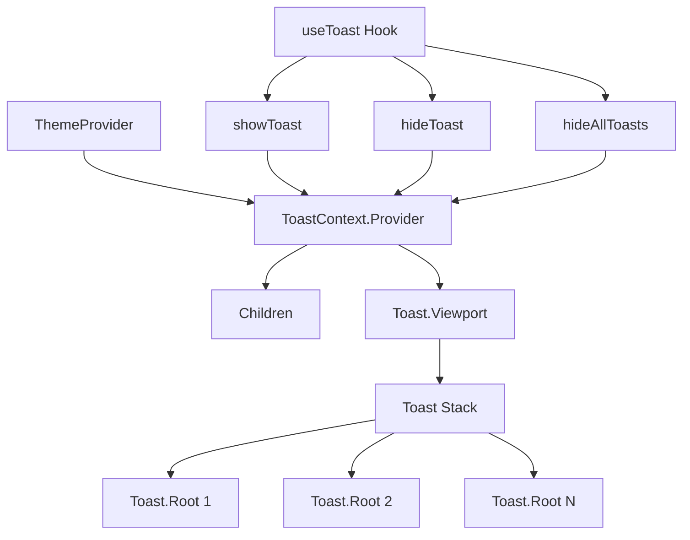

# Toast Component Implementation Plan

## Overview

This document outlines the implementation plan for a Toast notification component in `radix-ui-themes-native`. The Toast will be integrated with the existing ThemeProvider for simplified API and theme-aware styling.

## Design Decisions

### 1. API Pattern: Hybrid Approach with ThemeProvider Integration

The Toast functionality will be integrated into the existing ThemeProvider, eliminating the need for a separate ToastProvider wrapper.

```tsx
// App setup - no additional providers needed
<ThemeProvider toastConfig={{ position: 'bottom', maxVisible: 3 }}>
  <App />
</ThemeProvider>

// Usage anywhere in the app
const { toast } = useToast();

toast.show({ title: 'Saved successfully!', variant: 'success' });
toast.error({ title: 'Something went wrong' });
toast.hideAll();
```

### 2. Component Structure

```
Toast (compound export)
├── Toast.Viewport - Internal container that renders active toasts
├── Toast.Root - Individual toast container (used internally)
├── Toast.Title - Toast title text
├── Toast.Description - Toast description text
├── Toast.Close - Dismiss button
└── Toast.Action - Optional action button (Undo, Retry, etc.)
```

### 3. Hook API

```tsx
const { 
  toast,           // ToastController object
  toasts,          // Array of active toasts
  hide,            // Hide specific toast by ID
  hideAll,         // Hide all toasts
} = useToast();

// ToastController methods
toast.show(options)      // Show toast, returns ID
toast.success(options)   // Shorthand for success variant
toast.error(options)     // Shorthand for error variant
toast.warning(options)   // Shorthand for warning variant
toast.info(options)      // Shorthand for info variant
toast.accent(options)    // Shorthand for accent variant
```

### 4. Configuration Options

#### ThemeProvider Props (Global Config)

```tsx
interface ToastConfig {
  // Position of toast container
  position?: 'top' | 'bottom';
  
  // Maximum number of visible toasts in stack
  maxVisible?: number;  // default: 3
  
  // Default duration in milliseconds
  duration?: number;    // default: 5000
  
  // Default variant styling
  defaultVariant?: ToastVariant;
  
  // Whether toasts can be dismissed by swiping
  swipeToDismiss?: boolean;  // default: true
  
  // Gap between stacked toasts
  gap?: number;  // default: 8
}

<ThemeProvider toastConfig={{ position: 'bottom', maxVisible: 5 }}>
```

#### Individual Toast Options

```tsx
interface ToastOptions {
  // Content
  title: string;
  description?: string;
  
  // Styling
  variant?: 'default' | 'success' | 'error' | 'warning' | 'info' | 'accent';
  color?: Color;  // Override variant color
  
  // Behavior
  duration?: number;        // Override global duration
  position?: 'top' | 'bottom';  // Override global position
  
  // Actions
  action?: {
    label: string;
    onPress: () => void;
  };
  
  // Callbacks
  onDismiss?: () => void;
  onAutoClose?: () => void;
  
  // Accessibility
  accessibilityLabel?: string;
}
```

### 5. Variants and Colors

| Variant | Light Mode | Dark Mode | Use Case |
|---------|------------|-----------|----------|
| default | gray tones | gray tones | General notifications |
| success | green scale | green scale | Success operations |
| error | red scale | red scale | Error states |
| warning | yellow/orange | yellow/orange | Warning alerts |
| info | blue scale | blue scale | Information |
| accent | accentColor | accentColor | Brand highlights |

### 6. Toast Stacking Behavior

```
┌─────────────────────────┐
│                     [x] │  ← Toast 3 (newest)
│  Third toast message    │
├─────────────────────────┤
│                     [x] │  ← Toast 2
│  Second toast message   │
├─────────────────────────┤
│                     [x] │  ← Toast 1 (oldest)
│  First toast message    │
└─────────────────────────┘
```

- New toasts appear at the top of the stack
- When maxVisible is reached, oldest toast is dismissed
- Each toast has independent auto-dismiss timer
- Timers pause when toast is pressed/hovered (accessibility)

### 7. Animation

- **Enter**: Slide in from edge + fade in
- **Exit**: Slide out to edge + fade out
- **Swipe**: Follow finger, dismiss on threshold

```tsx
// Animation config
const toastAnimation = {
  duration: 300,
  easing: 'ease-out',
  enter: {
    opacity: 1,
    translateY: 0,
  },
  exit: {
    opacity: 0,
    translateY: position === 'top' ? -100 : 100,
  },
};
```

## Implementation Architecture

### File Structure

```
packages/radix-ui-themes-native/src/
├── theme/
│   └── ThemeProvider.tsx     # Modified to include toast state
├── components/
│   └── overlays/
│       ├── Toast.tsx         # Toast component
│       └── index.ts          # Export toast
└── hooks/
    └── useToast.ts           # useToast hook
```

### Context Integration

```tsx
// ThemeProvider.tsx (modified)
interface ThemeContextValue {
  theme: Theme;
  mode: ThemeMode;
  setMode: (mode: ThemeMode) => void;
  toggleMode: () => void;
  // New toast-related values
  toastConfig: ToastConfig;
  toasts: ToastData[];
  showToast: (options: ToastOptions) => string;
  hideToast: (id: string) => void;
  hideAllToasts: () => void;
}
```

### Component Flow Diagram



## Implementation Steps

### Phase 1: Core Infrastructure
- [ ] Extend ThemeProvider with toast state management
- [ ] Create ToastContext and useToast hook
- [ ] Define TypeScript types and interfaces

### Phase 2: Toast Component
- [ ] Create Toast.Viewport component
- [ ] Create Toast.Root component with animation
- [ ] Create Toast.Title, Toast.Description, Toast.Close
- [ ] Create Toast.Action component

### Phase 3: Variant Styling
- [ ] Implement variant color mapping
- [ ] Create variant-specific styles
- [ ] Handle high contrast mode

### Phase 4: Behavior
- [ ] Implement auto-dismiss timer
- [ ] Implement swipe-to-dismiss gesture
- [ ] Implement toast stacking logic
- [ ] Implement maxVisible limit

### Phase 5: Polish
- [ ] Add haptic feedback on show/dismiss
- [ ] Add accessibility support
- [ ] Add pause-on-interaction
- [ ] Create demo in playground app

### Phase 6: Documentation
- [ ] Update component-api.md
- [ ] Add usage examples
- [ ] Add inline JSDoc comments

## Usage Examples

### Basic Usage

```tsx
import { useToast } from 'radix-ui-themes-native';

function SaveButton() {
  const { toast } = useToast();
  
  const handleSave = async () => {
    try {
      await saveData();
      toast.success({ title: 'Saved successfully!' });
    } catch (error) {
      toast.error({ title: 'Failed to save', description: error.message });
    }
  };
  
  return <Button onPress={handleSave}>Save</Button>;
}
```

### With Action

```tsx
const { toast } = useToast();

toast.show({
  title: 'File deleted',
  description: 'Your file has been deleted.',
  variant: 'warning',
  action: {
    label: 'Undo',
    onPress: () => restoreFile(),
  },
});
```

### Custom Duration and Position

```tsx
toast.show({
  title: 'Processing...',
  description: 'This may take a while',
  duration: 10000,  // 10 seconds
  position: 'top',
});
```

### Programmatic Dismiss

```tsx
const { toast, hide } = useToast();

const id = toast.show({
  title: 'Connecting...',
  duration: Infinity,  // No auto-dismiss
});

// Later, when connection completes
hide(id);
```

## Accessibility Considerations

1. **Screen Reader**: Toast announces via `accessibilityLiveRegion='polite'`
2. **Focus Management**: Toast does not steal focus
3. **Dismiss**: Can be dismissed with escape key (future keyboard support)
4. **Pause on Touch**: Timer pauses when user interacts with toast
5. **High Contrast**: Variant colors respect high contrast mode

## Platform Considerations

### iOS
- Uses native-feeling animations
- Respects safe area insets
- Haptic feedback on success/error

### Android
- Material Design-inspired motion
- Respects navigation bar insets
- Haptic feedback on success/error

### Web (if applicable)
- CSS animations
- Keyboard dismiss support

## Open Questions

1. ~~Should we use Toast.Viewport or Toast.Portal?~~ → **Toast.Viewport** (better describes positioned container)
2. ~~API style: toast.show() vs toast({})?~~ → **toast.show()** with convenience methods
3. Should toasts persist across navigation? → Configurable via ThemeProvider
4. Should we support custom toast content (React nodes)? → Yes, via `children` prop

## References

- [Radix UI Toast (Web)](https://www.radix-ui.com/docs/primitives/components/toast)
- [React Native Toast Libraries](https://github.com/calintamas/react-native-toast-message)
- [Material Design Snackbars](https://m3.material.io/components/snackbar)
